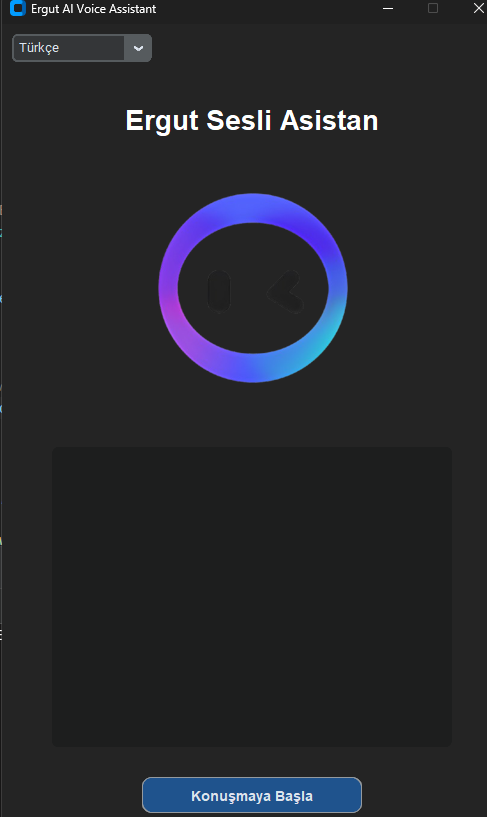

# Ergut - AI Voice Assistant

## English

**Ergut** is a modern voice assistant application developed in Python language and using CustomTkinter interface library. It provides easy use thanks to its user-friendly interface. It aims to take the personal assistant experience to the next level with artificial intelligence integration.

### Requirements
- Python 3.9+
- `CTkMessagebox==2.7`
- `customtkinter==5.2.2`
- `darkdetect==0.8.0`
- `packaging==25.0`
- `pillow==11.2.1`

### Installation
```bash
git clone https://github.com/thewoorens/ergut.git
cd ergut-assistant
pip install -r requirements.txt
python main.py
```

## Türkçe

**Ergut**, Python dili ile geliştirilen ve CustomTkinter arayüz kütüphanesini kullanan modern bir sesli asistan uygulamasıdır. Kullanıcı dostu arayüzü sayesinde kolay kullanım sağlar. Yapay zeka entegrasyonu ile birlikte kişisel asistan deneyimini üst seviyeye taşımayı hedefler.

### Gereksinimler
- Python 3.9+
- `CTkMessagebox==2.7`
- `customtkinter==5.2.2`
- `darkdetect==0.8.0`
- `packaging==25.0`
- `pillow==11.2.1`

### Kurulum
```bash
git clone https://github.com/thewoorens/ergut.git
cd ergut-assistant
pip install -r requirements.txt
python main.py
```
